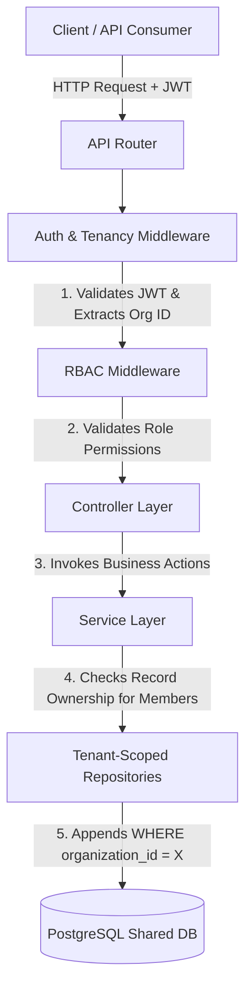
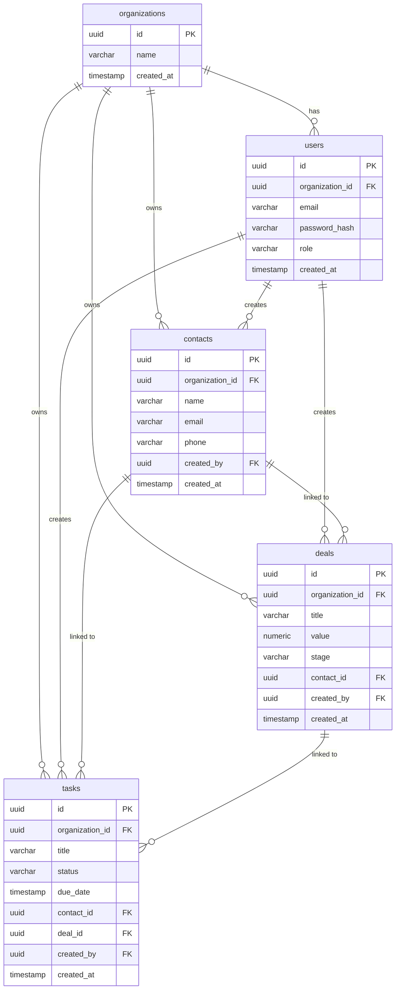

# Multi-Tenant SaaS CRM REST API with RBAC

A secure, enterprise-ready Customer Relationship Management (CRM) REST API built to power B2B SaaS products. This application implements a **Shared Database, Shared Schema** architecture to ensure clean data isolation between different organizations (tenants), enforces tenant-aware data access policies, and utilizes a robust Role-Based Access Control (RBAC) model.

---

## Architecture Flow

The system intercepts requests at the router boundary using layered Express.js middleware to build a "Tenant Context" for the lifecycle of each HTTP request before delegating tasks to repositories and services.



---

## Multi-Tenancy & Data Isolation Strategy

1. **Shared Database, Shared Schema**: All tenants share the same PostgreSQL database and database tables.
2. **Tenant Scoping Column**: Every tenant-specific table (`users`, `contacts`, `deals`, `tasks`) contains an `organization_id` UUID column.
3. **Programmatic Scoping**: The `Auth & Tenancy Middleware` decodes the user's JWT, extracts their `organizationId`, and attaches it to the request object. Repositories accept this ID in their constructors and automatically append `WHERE organization_id = ?` filters to all queries.
4. **Information Leakage Prevention**: If a user attempts to access or mutate a resource ID belonging to another organization, the database query returns no rows. The application then returns a `404 Not Found` response. This completely masks the existence of other tenants' records (a 403 response would leak that the resource ID exists).

### Performance Optimization (Composite Indexes)
To speed up scoping queries, composite and single indexes are declared on the tenant-scoping fields:
- `idx_contacts_org_id` on `contacts(organization_id)`
- `idx_contacts_org_id_email` on `contacts(organization_id, email)`
- `idx_deals_org_id` on `deals(organization_id)`
- `idx_tasks_org_id` on `tasks(organization_id)`

---

## Role-Based Access Control (RBAC) Matrix

Users belong to one of four roles with strict boundary permissions:

| Permission / Action | Owner | Admin | Member | Viewer |
| :--- | :---: | :---: | :---: | :---: |
| **Invite New Users** | Yes | Yes | No | No |
| **View Contacts/Deals/Tasks** | Yes | Yes | Yes (All) | Yes (All) |
| **Create Contacts/Deals/Tasks** | Yes | Yes | Yes | No |
| **Update Contacts/Deals/Tasks** | Yes (All) | Yes (All) | **Only if Creator** | No |
| **Delete Contacts/Deals/Tasks** | Yes (All) | Yes (All) | **Only if Creator** | No |

*Note: Members attempting to update/delete resources they did not create will receive a `403 Forbidden` response.*

---

## Database ERD



---

## Setup Instructions

### Environment Configuration
Make a copy of `.env.example` named `.env` and configure your settings:
```bash
cp .env.example .env
```

### 1. Running with Docker Compose (Recommended)
This runs both the database and the API service in isolated containers.
```bash
docker-compose up -d --build
```
The API server will start on port `8080` and the database on port `5432`.

### 2. Running & Testing Locally
If you want to run the tests locally on your host machine:

#### Port Conflict Workaround
If your local host machine has a native PostgreSQL service already running on port `5432` (e.g. standard local install):
1. Change `DB_PORT=5434` and `DB_HOST_PORT=5434` in your local `.env`.
2. Start the database service inside Docker Compose:
   ```bash
   docker-compose up -d db
   ```
   *(This maps the container's Postgres port to `5434` on the host, avoiding conflicts with your native service).*

#### Run Automated Tests
To execute unit and integration test suites:
```bash
npm run test
```
The integration tests cover registration, login, JWT issuance, cross-tenant intrusion attempts (404), foreign key hijacking (400), viewer mutation blockages (403), member ownership mutation rules, and dashboard aggregations.

#### Run in Development Mode
```bash
npm run dev
```

---

## API Specification

The complete API specification is available in two ways:
1. **Interactive Swagger UI**: When the application container is running, navigate to [http://localhost:8080/api-docs](http://localhost:8080/api-docs) in your browser. This UI allows you to directly explore and test all API endpoints.
2. **Static Spec File**: Open the [swagger.yaml](swagger.yaml) file at the root of the project.
